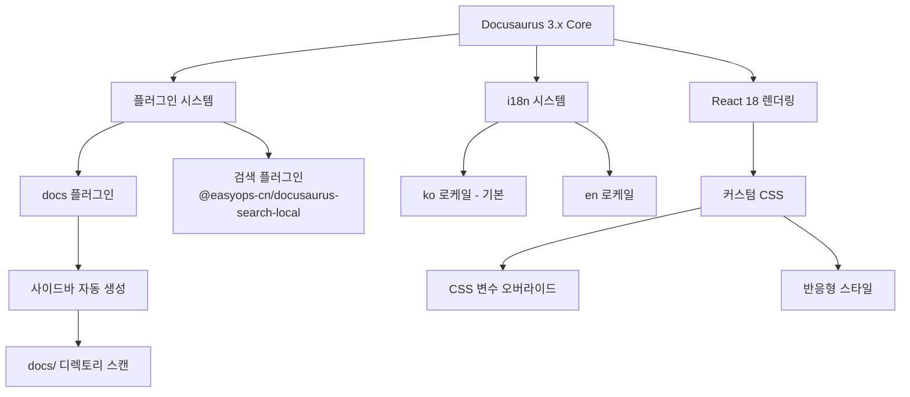
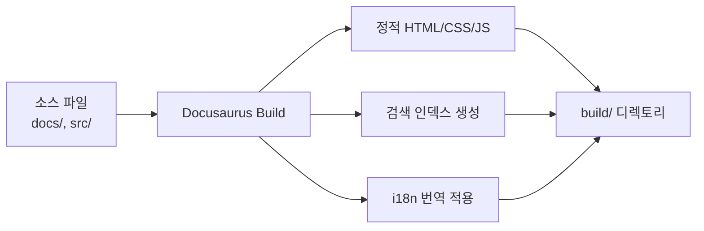

# 기술 설계 문서: Docusaurus 서비스 매뉴얼

## 개요 (Overview)

본 설계 문서는 Docusaurus 3.x와 React 18을 기반으로 한 서비스 매뉴얼 사이트의 기술 아키텍처를 정의한다. 이 사이트는 5개의 주요 메뉴와 각 메뉴별 3~5개의 상세 페이지로 구성되며, 로컬 검색, 한국어/영어 다국어 지원, 커스텀 CSS 스타일링을 제공한다.

### 핵심 기술 스택

| 기술 | 버전/상세 | 용도 |
|------|-----------|------|
| Docusaurus | 3.x (최신 안정 버전) | 정적 사이트 생성기 |
| React | 18.x | UI 렌더링 엔진 |
| @easyops-cn/docusaurus-search-local | 최신 버전 | 로컬 검색 플러그인 |
| Docusaurus i18n | 내장 | 다국어 지원 (ko/en) |
| Custom CSS | - | 외부 라이브러리 없이 직접 작성 |

### 설계 결정 사항

1. **검색 플러그인 선택**: `@easyops-cn/docusaurus-search-local`을 선택한다. Docusaurus v2/v3를 모두 지원하며, CJK(한중일) 언어에 최적화되어 한국어 검색에 적합하다.
2. **사이드바 자동 생성**: Docusaurus의 `autogenerated` 사이드바 타입을 사용하여 파일시스템 구조에서 자동으로 사이드바를 생성한다. 이를 통해 새 페이지 추가 시 수동 설정 변경이 불필요하다.
3. **i18n 전략**: Docusaurus 내장 i18n 시스템을 사용하며, 기본 로케일을 한국어(ko)로 설정한다. 영어 번역은 `i18n/en/` 디렉토리에 배치한다.
4. **CSS 전략**: Docusaurus 기본 테마의 CSS 변수를 활용하고, `src/css/custom.css`에서 커스텀 스타일을 정의한다.

## 아키텍처 (Architecture)

### 시스템 구조



### 빌드 파이프라인



## 컴포넌트 및 인터페이스 (Components and Interfaces)

### 1. 프로젝트 설정 (docusaurus.config.ts)

사이트의 핵심 설정을 정의하는 메인 설정 파일이다.

```typescript
// docusaurus.config.ts 구조
interface DocusaurusConfig {
  title: string;           // 사이트 제목
  tagline: string;         // 사이트 부제목
  url: string;             // 배포 URL
  baseUrl: string;         // 기본 경로
  i18n: {
    defaultLocale: 'ko';
    locales: ['ko', 'en'];
    localeConfigs: {
      ko: { label: '한국어', direction: 'ltr' };
      en: { label: 'English', direction: 'ltr' };
    };
  };
  themes: [
    ['@easyops-cn/docusaurus-search-local', SearchPluginConfig]
  ];
  presets: [
    ['classic', ClassicPresetConfig]
  ];
  themeConfig: ThemeConfig;
}
```

### 2. 검색 플러그인 설정

```typescript
interface SearchPluginConfig {
  hashed: true;              // 검색 인덱스 해싱
  language: ['ko', 'en'];   // 지원 언어
  indexDocs: true;           // 문서 인덱싱
  indexBlog: false;          // 블로그 비활성화
  docsRouteBasePath: '/docs';
}
```

### 3. 사이드바 설정 (sidebars.ts)

파일시스템 기반 자동 생성 사이드바를 사용한다.

```typescript
// sidebars.ts
interface SidebarsConfig {
  docsSidebar: Array<{
    type: 'autogenerated';
    dirName: string;  // '.' - docs 루트에서 자동 생성
  }>;
}
```

### 4. 네비게이션 바 설정

```typescript
interface NavbarConfig {
  title: string;
  logo: { alt: string; src: string };
  items: Array<{
    type: 'docSidebar';
    sidebarId: string;
    position: 'left' | 'right';
    label: string;
  } | {
    type: 'localeDropdown';
    position: 'right';
  }>;
}
```

### 5. 커스텀 CSS 구조

```css
/* src/css/custom.css 구조 */
:root {
  /* Docusaurus CSS 변수 오버라이드 */
  --ifm-color-primary: #2e8555;
  --ifm-font-family-base: /* 시스템 폰트 스택 */;
  /* 추가 커스텀 변수 */
}

[data-theme='dark'] {
  /* 다크 모드 변수 */
}

/* 반응형 미디어 쿼리 */
@media (max-width: 996px) { /* 태블릿 */ }
@media (max-width: 576px) { /* 모바일 */ }
```

## 데이터 모델 (Data Models)

### 프로젝트 디렉토리 구조

```
service-manual/
├── docusaurus.config.ts          # 메인 설정 파일
├── sidebars.ts                   # 사이드바 설정
├── package.json                  # 의존성 및 스크립트
├── tsconfig.json                 # TypeScript 설정
├── babel.config.js               # Babel 설정
├── docs/                         # 문서 콘텐츠 (기본 로케일: ko)
│   ├── 01-getting-started/       # 메뉴 1: 시작하기
│   │   ├── _category_.json       # 카테고리 메타데이터
│   │   ├── 01-introduction.md
│   │   ├── 02-installation.md
│   │   └── 03-quick-start.md
│   ├── 02-user-guide/            # 메뉴 2: 사용자 가이드
│   │   ├── _category_.json
│   │   ├── 01-basic-usage.md
│   │   ├── 02-advanced-features.md
│   │   ├── 03-settings.md
│   │   └── 04-shortcuts.md
│   ├── 03-admin-guide/           # 메뉴 3: 관리자 가이드
│   │   ├── _category_.json
│   │   ├── 01-user-management.md
│   │   ├── 02-permissions.md
│   │   └── 03-system-config.md
│   ├── 04-api-reference/         # 메뉴 4: API 레퍼런스
│   │   ├── _category_.json
│   │   ├── 01-authentication.md
│   │   ├── 02-endpoints.md
│   │   ├── 03-error-codes.md
│   │   └── 04-rate-limiting.md
│   └── 05-troubleshooting/       # 메뉴 5: 문제 해결
│       ├── _category_.json
│       ├── 01-common-issues.md
│       ├── 02-error-messages.md
│       └── 03-faq.md
├── i18n/
│   └── en/                       # 영어 번역
│       ├── docusaurus-plugin-content-docs/
│       │   └── current/          # docs 번역 파일
│       │       ├── 01-getting-started/
│       │       ├── 02-user-guide/
│       │       ├── 03-admin-guide/
│       │       ├── 04-api-reference/
│       │       └── 05-troubleshooting/
│       └── docusaurus-theme-classic/
│           └── navbar.json       # 네비게이션 라벨 번역
├── src/
│   ├── css/
│   │   └── custom.css            # 커스텀 CSS
│   └── pages/
│       └── index.tsx             # 랜딩 페이지 (선택)
└── static/
    └── img/                      # 정적 이미지 자산
```

### 문서 파일 구조 (Frontmatter)

각 마크다운 문서 파일은 다음 frontmatter 구조를 따른다:

```yaml
---
sidebar_position: 1          # 사이드바 내 순서
title: "페이지 제목"          # 페이지 제목
description: "페이지 설명"    # SEO 및 검색용 설명
---
```

### 카테고리 메타데이터 (_category_.json)

각 카테고리 디렉토리에 포함되는 메타데이터 파일:

```json
{
  "label": "시작하기",
  "position": 1,
  "link": {
    "type": "generated-index",
    "description": "서비스 시작에 필요한 기본 정보를 안내합니다."
  }
}
```

### 네비게이션 메뉴 구조

| 순서 | 메뉴 ID | 한국어 라벨 | 영어 라벨 | 하위 페이지 수 |
|------|---------|-------------|-----------|----------------|
| 1 | getting-started | 시작하기 | Getting Started | 3 |
| 2 | user-guide | 사용자 가이드 | User Guide | 4 |
| 3 | admin-guide | 관리자 가이드 | Admin Guide | 3 |
| 4 | api-reference | API 레퍼런스 | API Reference | 4 |
| 5 | troubleshooting | 문제 해결 | Troubleshooting | 3 |

### 네이밍 규칙

- **디렉토리**: `{순번}-{kebab-case-이름}/` (예: `01-getting-started/`)
- **파일**: `{순번}-{kebab-case-이름}.md` (예: `01-introduction.md`)
- **순번 형식**: 2자리 숫자 (01, 02, ..., 99)
- **새 페이지 추가**: 기존 파일 수정 없이 다음 순번으로 파일 추가

## 오류 처리 (Error Handling)

### 빌드 시 오류 처리

| 오류 유형 | 원인 | 처리 방법 |
|-----------|------|-----------|
| 설정 파일 오류 | docusaurus.config.ts 문법 오류 | Docusaurus CLI가 상세 오류 메시지 출력 |
| 마크다운 파싱 오류 | frontmatter 형식 오류, 잘못된 링크 | 빌드 시 경고/오류 메시지로 파일 위치 표시 |
| 의존성 누락 | node_modules 미설치 | `npm install` 실행 안내 |
| 번역 파일 누락 | i18n 디렉토리에 번역 파일 없음 | 기본 로케일 콘텐츠로 폴백 |
| 검색 인덱스 오류 | 플러그인 설정 오류 | 빌드 로그에 플러그인 오류 출력 |

### 런타임 오류 처리

| 오류 유형 | 원인 | 처리 방법 |
|-----------|------|-----------|
| 404 페이지 | 존재하지 않는 URL 접근 | Docusaurus 기본 404 페이지 표시 |
| 검색 실패 | 검색 인덱스 로드 실패 | 검색 UI에서 오류 상태 표시 |
| 로케일 전환 실패 | 번역 파일 누락 | 기본 로케일로 폴백 |

### 개발 환경 오류 처리

- **핫 리로드 실패**: 개발 서버 재시작으로 해결
- **포트 충돌**: Docusaurus가 대체 포트 자동 제안
- **TypeScript 타입 오류**: 빌드 전 타입 체크로 사전 감지

## 테스트 전략 (Testing Strategy)

### PBT 비적용 사유

본 프로젝트는 Property-Based Testing이 적합하지 않다. 그 이유는 다음과 같다:

1. **설정 기반 프로젝트**: 대부분의 기능이 설정 파일(docusaurus.config.ts, sidebars.ts) 작성으로 구현되며, 순수 함수나 데이터 변환 로직이 없다.
2. **외부 프레임워크 의존**: 핵심 기능(사이드바 생성, 검색 인덱싱, i18n)이 Docusaurus 프레임워크와 플러그인에 의해 처리된다.
3. **정적 콘텐츠**: 문서 페이지는 마크다운 파일로 구성되며, 입력에 따라 동작이 변하는 로직이 없다.
4. **UI 렌더링 중심**: 대부분의 인수 조건이 UI 표시, 파일 존재 여부, 설정 값 확인에 해당한다.

### 테스트 접근 방식

#### 1. 스모크 테스트 (Smoke Tests)

프로젝트 설정과 구조가 올바른지 확인하는 기본 검증 테스트이다.

| 테스트 항목 | 검증 내용 |
|-------------|-----------|
| 의존성 확인 | package.json에 Docusaurus 3.x, React 18.x, 검색 플러그인 포함 |
| 설정 파일 존재 | docusaurus.config.ts, sidebars.ts 존재 |
| 외부 CSS 부재 | tailwindcss, bootstrap 등 미포함 |
| npm 스크립트 | start, build, serve 스크립트 정의 |
| i18n 설정 | defaultLocale: 'ko', locales: ['ko', 'en'] |

#### 2. 구조 검증 테스트 (Structure Validation Tests)

파일시스템 구조와 콘텐츠가 요구사항을 충족하는지 확인한다.

| 테스트 항목 | 검증 내용 |
|-------------|-----------|
| 카테고리 수 | docs/ 하위에 정확히 5개의 카테고리 디렉토리 |
| 페이지 수 | 각 카테고리에 3~5개의 .md 파일 |
| 네이밍 규칙 | 모든 파일/디렉토리가 순번-kebab-case 패턴 준수 |
| i18n 구조 | i18n/en/ 디렉토리에 번역 파일 배치 |
| 기본 예제 제거 | tutorial, blog 관련 파일 부재 |

#### 3. 빌드 통합 테스트 (Build Integration Tests)

실제 빌드를 실행하여 전체 시스템이 올바르게 동작하는지 확인한다.

| 테스트 항목 | 검증 내용 |
|-------------|-----------|
| 빌드 성공 | `npm run build` 오류 없이 완료 |
| 출력 디렉토리 | build/ 디렉토리 생성 |
| 로케일별 출력 | ko, en 로케일 파일 생성 |
| 검색 인덱스 | 검색 인덱스 파일 생성 |
| 외부 CDN 부재 | HTML에 외부 CSS CDN 링크 없음 |

#### 4. 콘텐츠 검증 테스트 (Content Validation Tests)

문서 파일의 내용이 올바른 형식을 따르는지 확인한다.

| 테스트 항목 | 검증 내용 |
|-------------|-----------|
| Frontmatter | 모든 .md 파일에 title, sidebar_position 포함 |
| 카테고리 메타데이터 | 각 디렉토리에 _category_.json 존재 |
| 플레이스홀더 콘텐츠 | 각 페이지에 의미 있는 콘텐츠 포함 |
| CSS 변수 사용 | custom.css에 --ifm- 변수 활용 |
| 반응형 디자인 | custom.css에 @media 쿼리 포함 |

### 테스트 실행 방법

```bash
# 빌드 테스트 (가장 포괄적인 검증)
npm run build

# 개발 서버 테스트
npm run start

# 특정 로케일 빌드 테스트
npm run build -- --locale en

# 정적 서버 테스트
npm run serve
```

### 수동 검증 체크리스트

빌드 테스트 외에 다음 항목은 수동으로 확인한다:

- [ ] 모든 메뉴 항목 클릭 시 올바른 페이지 이동
- [ ] 검색 기능으로 한국어/영어 콘텐츠 검색 가능
- [ ] 언어 전환 시 모든 콘텐츠 번역 표시
- [ ] 모바일/태블릿 화면에서 반응형 레이아웃 정상 동작
- [ ] 브레드크럼 네비게이션 정상 표시
- [ ] 다크 모드 전환 시 스타일 정상 적용

